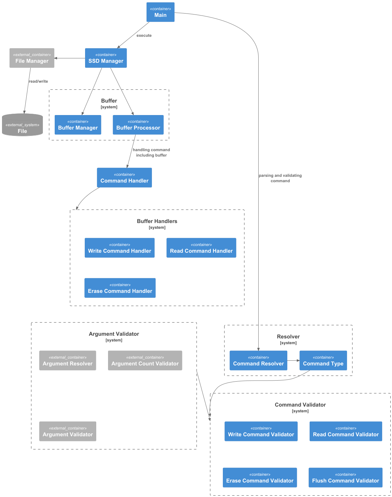

# DS Virtual SSD Project
Device Solution 팀의 가상 SSD 제작 프로젝트

## Components
- SSD 모듈
  - SSD
    - file을 읽고 쓰는 장치 (SW적 구현)
- Shell 모듈
  - Test Shell
    - SSD를 테스트하는 프로그램
  - Test Script
    - Test Shell 안에서 구현되는
      SSD 테스트 코드

# Diagrams

## SSD


## Shell & Shell Script


# How to Use
ssd.jar와 shell.jar 빌드
```shell
./gradlew clean build -x test
```
## SSD
- LBA에 Value 저장하기
  ```shell
  java -jar ssd.jar W {LBA} {Value}
  ```
- LBA에 있는 Value 읽어서 output.txt에 저장
  ```shell
  java -jar ssd.jar R {LBA}
  ```
- LBA에 있는 내용 지우기
  ```shell
  java -jar ssd.jar E {LBA} {SIZE}
  ```
- 버퍼 내용 flush 하기
  ```shell
    java -jar ssd.jar F
  ```
## Test Shell
```shell
java -jar shell.jar
Shell> 
```
- write
- read
- erase
- flush
- exit
- help
- fullwrite
- fullread

## Test Script
shell.jar 빌드 선행 후 실행
- Testcase 1 실행
  ```shell
  java -jar shell.jar
  Shell > [1_FullWriteAndReadCompare|1_]
  ```
- Testcase 2 실행
  ```shell
  java -jar shell.jar
  Shell > [2_PartialLBAWrite|2_]
  ```
- Testcase 3 실행
  ```shell
  java -jar shell.jar
  Shell > [3_WriteReadAging|3_]
  ```
- Testcase 4 실행
  ```shell
  java -jar shell.jar
  Shell > [4_EraseAndWriteAging|4_]
  ```